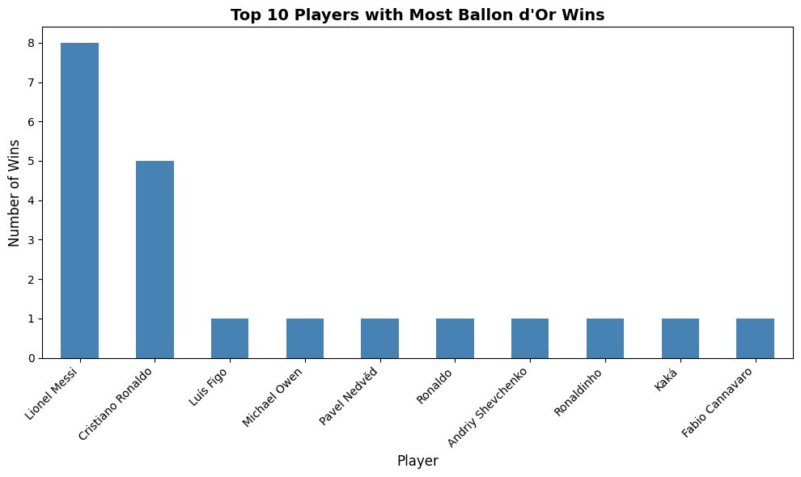
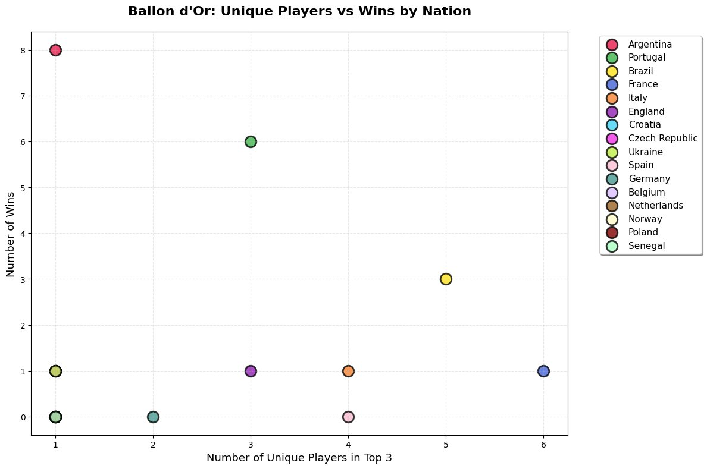
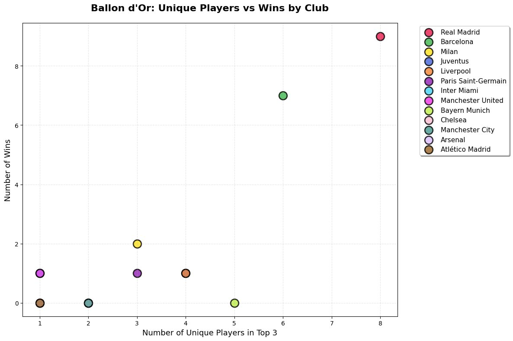

#  Ballon d'Or Scraper & Analyser


A Python tool that scrapes, cleans, and analyses historical **Ballon d'Or** award data directly from Wikipedia — with built-in player querying and three visualisation modes.

---

##  Overview

The Ballon d'Or Wikipedia page stores award data across multiple decade-grouped tables with inconsistent structures, rowspan-merged year cells, and nationality represented as flag images rather than plain text. This scraper handles all of that programmatically through a single function call.

Given a year range and a player's name, the tool:
- Fetches and parses all relevant tables from the live Wikipedia page
- Reconstructs a clean, unified DataFrame covering every top-3 nominee
- Extracts nationality from embedded flag images (not available via standard `pd.read_html`)
- Reports how many times a player appeared in the top 3 and how many times they won
- Optionally generates charts for player, nation, or club analysis

---

##  Features

- **Robust HTML parsing** — handles rowspan year cells, multi-structure tables, and flag image nationality extraction via BeautifulSoup
- **Flexible year filtering** — query any range from 1956 to present
- **Player query** — instant top-3 and win count for any nominee
- **Three visualisation modes:**
  - `"Player"` — bar chart of top-10 all-time winners
  - `"Nation"` — scatter plot of unique players vs wins by nationality
  - `"Club"` — scatter plot of unique players vs wins by club
- **Clean output DataFrame** with consistent columns: `Year`, `Player`, `Nationality`, `Club`, `Points`, `Winner`

---

##  Example Output

```python
url       = "https://en.wikipedia.org/wiki/Ballon_d%27Or"
start     = 2000
end       = 2023
PerfQuery = "Lionel Messi"

df = ballon_dor_scraper(url, start, end, PerfQuery, viz="None")
```

```
Between the years 2000 and 2023, Lionel Messi was in Top 3 for the
Ballon d'Or Award 16 times. Among those, Lionel Messi won the award 8 times.
```

| Year | Player          | Nationality | Club        | Points | Winner |
|------|-----------------|-------------|-------------|--------|--------|
| 2000 | Luís Figo       | Portugal    | Real Madrid | 197    | True   |
| 2000 | Zinedine Zidane | France      | Juventus    | 181    | False  |
| 2000 | Andriy Shevchenko | Ukraine   | Milan       | 85     | False  |
| 2001 | Michael Owen    | England     | Liverpool   | 176    | True   |
| 2001 | Raúl            | Spain       | Real Madrid | 140    | False  |

---

##  Visualisations

### Player — Top 10 Winners (2000–2023)


### Nation — Unique Players vs Wins by Nationality


### Club — Unique Players vs Wins by Club


---

##  Getting Started

### 1. Clone the repository
```bash
git clone https://github.com/pedramebd/ballon-dor-scraper.git
cd ballon-dor-scraper
```

### 2. Install dependencies
```bash
pip install -r requirements.txt
```

### 3a. Run the quick demo (no Jupyter needed)
```bash
# Default: Lionel Messi, 2000–2023, no chart
python demo.py

# Custom player and year range
python demo.py --player "Cristiano Ronaldo" --start 2010 --end 2023

# With a visualisation
python demo.py --viz Nation
python demo.py --player "Ronaldo" --start 1995 --end 2005 --viz Club
```

### 3b. Open the notebook
```bash
jupyter notebook ballon_dor_scraper.ipynb
```

---

##  Function Signature

```python
ballon_dor_scraper(url, start, end, PerfQuery, viz="None")
```

| Parameter   | Type  | Description                                                                 |
|-------------|-------|-----------------------------------------------------------------------------|
| `url`       | `str` | Wikipedia Ballon d'Or page URL                                              |
| `start`     | `int` | Start year (inclusive)                                                      |
| `end`       | `int` | End year (inclusive)                                                        |
| `PerfQuery` | `str` | Player name to query (partial match, case-insensitive)                      |
| `viz`       | `str` | Visualisation mode: `"None"` · `"Player"` · `"Nation"` · `"Club"`         |

**Returns:** `pd.DataFrame` with columns `Year`, `Player`, `Nationality`, `Club`, `Points`, `Winner`

---

##  Tech Stack

| Library        | Purpose                              |
|----------------|--------------------------------------|
| `requests`     | HTTP page fetching                   |
| `BeautifulSoup`| HTML parsing & flag image extraction |
| `pandas`       | Data cleaning, filtering, aggregation|
| `matplotlib`   | Chart generation                     |
| `re`           | Footnote cleaning & year parsing     |

---

##  Project Structure

```
ballon-dor-scraper/
├── ballon_dor_scraper.ipynb   # Main notebook with full outputs
├── demo.py                    # Command-line demo (no Jupyter needed)
├── requirements.txt           # Python dependencies
├── .gitignore
├── assets/                    # Visualisation screenshots
│   ├── player_viz.png
│   ├── nation_viz.png
│   └── club_viz.png
└── README.md
```

---

##  Author

**Pedram Ebadollahyvahed** — MSc Data Science, Cardiff University (2025–2026)

[GitHub](https://github.com/pedramebd) · [LinkedIn](https://www.linkedin.com/in/pedramebadollahyvahed)
